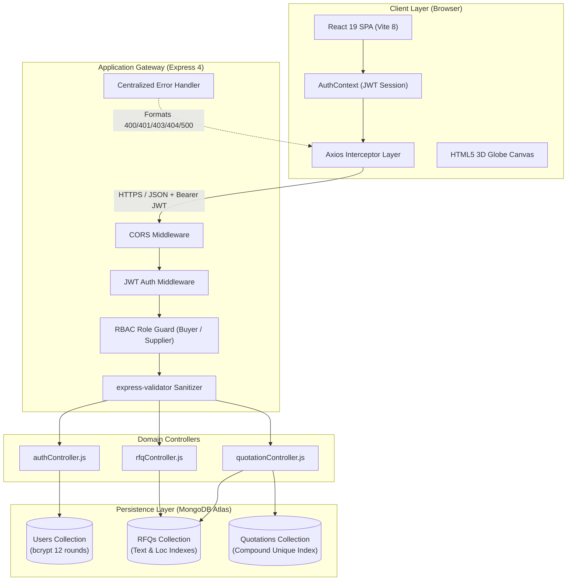
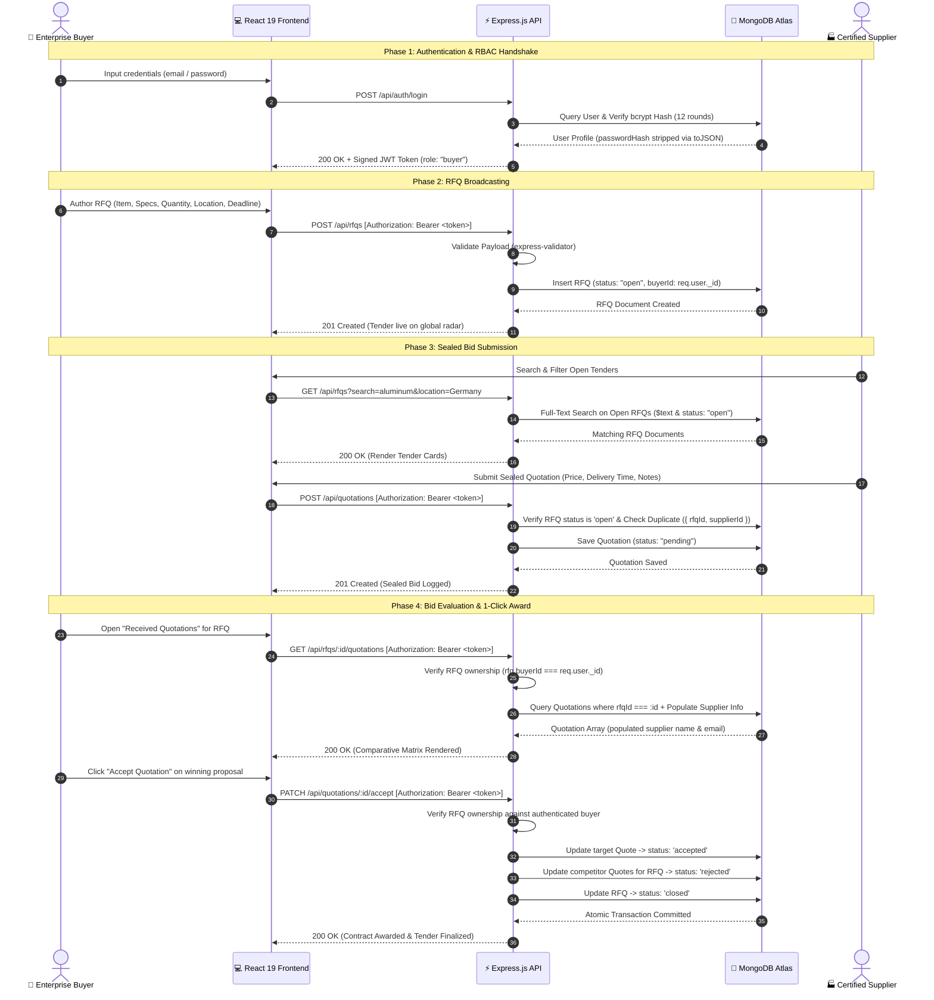
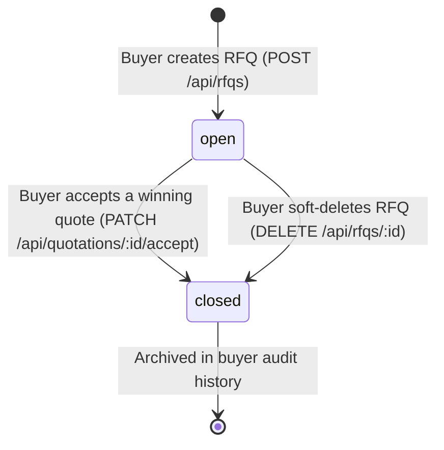
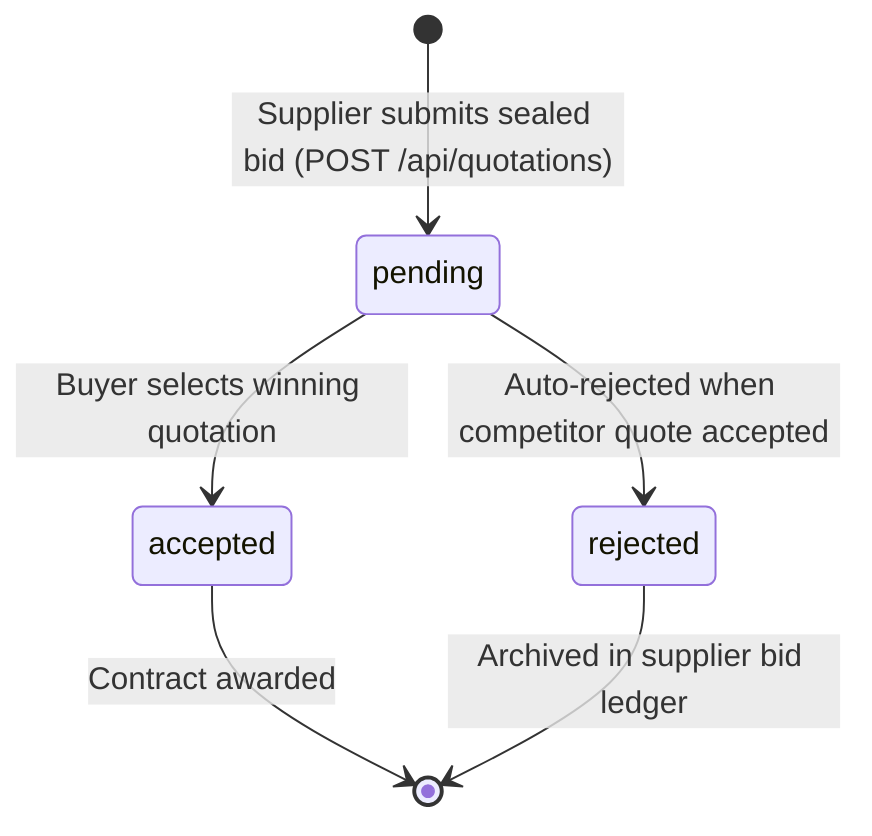

<div align="center">

# 🌐 NexQuote — Enterprise B2B RFQ Marketplace
### Autonomous Global Procurement, Sealed Quotations & Resilient Supply Chain Infrastructure

[](https://github.com/Utkarsh-Tyagi-16/B2B-RFQ-Marketplace)
[](https://github.com/Utkarsh-Tyagi-16/B2B-RFQ-Marketplace)
[](https://nodejs.org/)
[](https://react.dev/)
[](https://www.mongodb.com/atlas)
[](https://render.com)
[](LICENSE)

<p align="center">
  A production-ready, full-stack <strong>B2B Request for Quotation (RFQ)</strong> marketplace engineered for high-value enterprise manufacturing and international supply chains. Facilitates transparent RFQ broadcasting, private sealed-bid quotation submissions, multi-metric quote evaluation matrices, and single-click contract awarding.
</p>

[Explore Repository](https://github.com/Utkarsh-Tyagi-16/B2B-RFQ-Marketplace) • [Live API Health](https://b2b-rfq-marketplace.onrender.com/api/health) • [API Specification](#-complete-api-reference) • [Test Suite](#-automated-testing--quality-assurance) • [Quickstart Guide](#-local-setup--installation)

</div>

---

## 📑 Table of Contents

- [Executive Summary](#-executive-summary)
- [Quick Demo Accounts](#-quick-demo-accounts)
- [System Architecture & Data Flow](#-system-architecture--data-flow)
  - [High-Level Architecture](#high-level-architecture)
  - [Procurement & Bidding Sequence](#procurement--bidding-sequence)
  - [Entity State Machines](#entity-state-machines)
- [Key Features by Stakeholder](#-key-features-by-stakeholder)
  - [For Enterprise Buyers](#1-for-enterprise-buyers)
  - [For Certified Suppliers](#2-for-certified-suppliers)
- [Data Models & Schema Specifications](#-data-models--schema-specifications)
- [Design System & Frontend Aesthetics](#-design-system--frontend-aesthetics)
  - [Aesthetic Philosophy](#aesthetic-philosophy)
  - [Color Palette Tokens](#color-palette-tokens)
  - [Typography Hierarchy](#typography-hierarchy)
  - [Interactive 3D Canvas Visualization](#interactive-3d-canvas-visualization)
- [Technology Stack Matrix](#-technology-stack-matrix)
- [Project Directory Structure](#-project-directory-structure)
- [Local Setup & Installation](#-local-setup--installation)
  - [Prerequisites](#prerequisites)
  - [Step 1: Clone Repository](#step-1-clone-repository)
  - [Step 2: Backend Configuration](#step-2-backend-configuration)
  - [Step 3: Frontend Configuration](#step-3-frontend-configuration)
  - [Troubleshooting Common Issues](#troubleshooting-common-issues)
- [Automated Testing & Quality Assurance](#-automated-testing--quality-assurance)
  - [Test Suite Architecture](#test-suite-architecture)
  - [Test Execution Matrix (45/45 Passed)](#test-coverage-breakdown)
  - [Targeted Test Runs](#targeted-test-execution)
- [Complete API Reference](#-complete-api-reference)
  - [Standard Envelope](#standard-envelope)
  - [Authentication Endpoints](#1-authentication-endpoints)
  - [RFQ Procurement Endpoints](#2-rfq-procurement-endpoints)
  - [Quotation Endpoints](#3-quotation-endpoints)
- [Cloud Deployment Guide (Render & MongoDB Atlas)](#-cloud-deployment-guide-render--mongodb-atlas)
- [Security, Compliance & Auditing Model](#-security-compliance--auditing-model)
- [Roadmap & Future Extensions](#-roadmap--future-extensions)
- [Contributing & License](#-contributing--license)

---

## 🚀 Executive Summary

Traditional enterprise procurement is plagued by fragmented email exchanges, opaque spreadsheet pricing, high vendor verification friction, and risks of bid tampering. **NexQuote** transforms industrial procurement into a modernized, transparent, and auditable digital workflow:

* **Broadcast Radar**: Real-time commercial tender announcements with structured unit volumes, delivery coordinates, and strict submission deadlines.
* **Anti-Collusion Sealed Bidding**: Quotations are securely sealed and accessible exclusively to the buyer who authored the RFQ, eliminating bid-rigging and front-running.
* **Multi-Metric Evaluation Matrix**: Automated comparison across per-unit quotes, total contract expenditure, estimated fulfillment lead times, and supplier notes.
* **Instant 1-Click Award Engine**: Accepting a bid atomically flags the winner, transitions competing bids to `rejected`, and closes the RFQ to prevent subsequent submissions.
* **High-Performance 3D Visualization**: Pure HTML5 Canvas rendering a mathematically projected, rotating 3D Earth sphere with real-world trade hubs and dynamic trade-arc telemetry.

---

## ⚡ Quick Demo Accounts

For instant local or cloud testing, pre-configured role-based credentials can be registered or utilized:

| Role | Email | Password | Primary Capabilities |
|---|---|---|---|
| **Enterprise Buyer** | `buyer@enterprise.com` | `Password123!` | Create RFQs, inspect received bids, accept quotations, close tenders |
| **Certified Supplier** | `supplier@globalmfg.com` | `Password123!` | Search live RFQ radar, submit sealed bids, track quotation history |

> [!TIP]
> You can also create new accounts instantly from the [Sign Up Portal](http://localhost:5173/signup) by selecting the corresponding **Enterprise Buyer** or **Certified Supplier** account type cards.

---

## 🔄 System Architecture & Data Flow

### High-Level Architecture



---

### Procurement & Bidding Sequence



---

### Entity State Machines

#### RFQ Lifecycle


#### Quotation Lifecycle


---

## 🎯 Key Features by Stakeholder

### 1. For Enterprise Buyers
* **Structured RFQ Authoring**: Create detailed procurement specifications including technical item nomenclature, unit volumes, global delivery targets, and strict submission deadlines.
* **Tender Management Console**: Comprehensive catalog of active and historical RFQs with dynamic status indicators (`open` vs. `closed`).
* **In-Flight Specification Updates**: Edit procurement descriptions, delivery coordinates, or target deadlines prior to bid finalization.
* **Sealed Bid Evaluation Dashboard**: Inspect all submitted proposals side-by-side with calculated total order values, per-unit metrics, fulfillment lead times, and supplier remarks.
* **1-Click Contract Awarding**: Accept the optimal quotation with automatic contract closure, atomic rejection of competitor bids, and immediate RFQ status locking.

### 2. For Certified Suppliers
* **Live Procurement Radar**: Browse public tenders with real-time text matching on item titles and descriptions, filtered by geographic delivery location.
* **Full Technical Specifications**: Review item parameters, required quantities, destination logistics hubs, and countdown deadlines before submitting bids.
* **Confidential Sealed Quotations**: Submit competitive pricing, turnaround lead times (e.g. *10 business days*), and supplier assurances with complete privacy from competitor viewing.
* **Quotation History & Tracking**: Real-time status tracking (`pending`, `accepted`, `rejected`) across all historical quotes submitted by your supplier organization.

---

## 📊 Data Models & Schema Specifications

The database layer is modeled via Mongoose 8 on MongoDB Atlas, featuring strict validation, sanitization transforms, and strategic database indexing:

### 1. User Model (`User.js`)
| Field | Type | Constraints | Description |
|---|---|---|---|
| `name` | `String` | Required, trim, minlength: 2 | Individual or corporate organization name |
| `email` | `String` | Required, unique, lowercase, regex validated | Normalized authentication identifier |
| `passwordHash` | `String` | Required | Salted bcrypt hash (12 rounds). Stripped via `.toJSON()` |
| `role` | `String` | Required, enum: `['buyer', 'supplier']` | RBAC authorization role |
| `createdAt` / `updatedAt` | `Date` | Managed automatically | Mongoose timestamps |

### 2. RFQ Model (`RFQ.js`)
| Field | Type | Constraints | Description |
|---|---|---|---|
| `buyerId` | `ObjectId` | Required, ref: `User` | Owner reference for authorization checks |
| `productOrServiceName` | `String` | Required, trim, minlength: 3 | Name/title of requested product or service |
| `description` | `String` | Required, trim, minlength: 10 | Technical specs, tolerances, and quality criteria |
| `quantity` | `Number` | Required, min: 1 | Requested unit volume |
| `deliveryLocation` | `String` | Required, trim | Destination hub, port, or facility |
| `deadline` | `Date` | Required | Submission cut-off timestamp |
| `status` | `String` | enum: `['open', 'closed']`, default: `'open'` | Current tender status |

* **Indexes**:
  * Text Index: `{ productOrServiceName: 'text', description: 'text' }` for full-text tender searching.
  * Location Index: `{ deliveryLocation: 1 }` for geographic routing queries.

### 3. Quotation Model (`Quotation.js`)
| Field | Type | Constraints | Description |
|---|---|---|---|
| `rfqId` | `ObjectId` | Required, ref: `RFQ` | Target RFQ tender reference |
| `supplierId` | `ObjectId` | Required, ref: `User` | Bidding supplier reference |
| `quotedPrice` | `Number` | Required, min: 0.01 | Total or unit proposal price |
| `estimatedDeliveryTime` | `String` | Required, trim | Human-readable fulfillment lead time |
| `message` | `String` | Trim, optional | Supplier notes, certifications, freight remarks |
| `status` | `String` | enum: `['pending', 'accepted', 'rejected']` | Quotation resolution state |

* **Compound Unique Index**:
  * `{ rfqId: 1, supplierId: 1 }` with `{ unique: true }` — Guarantees at the database level that a supplier can submit exactly one sealed quotation per RFQ.

---

## 🎨 Design System & Frontend Aesthetics

### Aesthetic Philosophy
The visual identity of NexQuote draws inspiration from modern aerospace telemetry and high-consequence industrial consoles (*e.g., United Carriers, Palantir Foundry*). It deliberately moves away from generic corporate templates in favor of a deep cosmic dark aesthetic with solar energy accents.

```
┌────────────────────────────────────────────────────────────────────────┐
│  COSMIC OBSIDIAN [#020409] ─── Deep space background with subtle noise │
│  SOLAR AMBER     [#f97316] ─── High-priority highlights & active status│
│  ELECTRIC CYAN   [#38bdf8] ─── Data links, live beacons & telemetry    │
│  EMERALD SUCCESS [#10b981] ─── Accepted bids & verified trust badges   │
│  ROSE DANGER     [#f43f5e] ─── Closed tenders & rejected proposals     │
└────────────────────────────────────────────────────────────────────────┘
```

### Color Palette Tokens
```css
:root {
  --bg-cosmic: #020409;          /* Deepest space canvas */
  --bg-card: rgba(13, 17, 23, 0.75); /* Frosted glassmorphic card */
  --border-subtle: rgba(255, 255, 255, 0.08); /* Precision 1px grid line */
  --border-focus: rgba(249, 115, 22, 0.4);   /* Solar amber glow border */
  --accent-solar: #f97316;       /* Radiant amber primary CTA */
  --accent-amber-glow: #ea580c;  /* Button hover gradient */
  --accent-cyan: #38bdf8;        /* Telemetry markers and icons */
  --accent-indigo: #6366f1;      /* Secondary gradient accents */
  --text-primary: #f8fafc;       /* 98% brightness headline white */
  --text-secondary: #94a3b8;     /* Slate-400 subtext and descriptions */
  --text-muted: #64748b;         /* Low-contrast metadata tags */
  --badge-emerald: #10b981;      /* Status: Accepted / Verified */
  --badge-rose: #f43f5e;         /* Status: Rejected / Closed */
}
```

### Typography Hierarchy
* **Display Headlines**: **`Syne`** (800 Extra-Bold) — Angular, architectural cuts that give large hero titles an authoritative industrial presence.
* **Telemetry & HUD Labels**: **`Space Grotesk`** (500/600/700) with wide tracking (`letter-spacing: 0.12em - 0.18em`) for uppercase badges and section tags.
* **Body & Explanatory Copy**: **`Inter`** and **`Plus Jakarta Sans`** for maximum typographic clarity and effortless reading.
* **Financial Figures & Timestamps**: **`JetBrains Mono`** for aligned numerical columns, prices, and countdown timers.

### Interactive 3D Canvas Visualization
The landing page features a zero-dependency HTML5 2D Canvas rendering a 3D spherical point cloud:
* **Mathematical Projection**: Computes 3D spherical coordinates $(x, y, z)$ based on latitude, longitude, and an active rotational matrix with dynamic mouse parallax tilt.
* **Atmospheric Scattering**: Layered radial gradients simulate a solar corona and atmospheric limb glow.
* **Global Trade Hubs**: Renders pulsing radar beacons and HUD callout tags for key industrial centers (`MUMBAI`, `TOKYO`, `SINGAPORE`, `DUBAI`, `FRANKFURT`, `LONDON`, `NEW YORK`).
* **Active Logistics Arcs**: Animated bezier curves projecting commercial procurement routes between continents with streaming photon pulses.

---

## 🛠 Technology Stack Matrix

| Tier | Component | Version / Spec | Purpose & Engineering Rationale |
|---|---|---|---|
| **Frontend** | React | 19.x | Concurrent rendering, modern hooks, zero memory leaks |
| **Frontend** | Vite | 8.x | Sub-100ms Hot Module Replacement (HMR) and optimized rollup production bundles |
| **Frontend** | React Router | v7.x | Declarative client-side routing with protected RBAC wrapper routes |
| **Frontend** | Axios | 1.x | Configured instance with automatic JWT Bearer injection and global 401 redirection |
| **Frontend** | Vanilla CSS3 | Modern CSS | Zero runtime overhead, custom properties, glassmorphism, hardware-accelerated animations |
| **Backend** | Node.js | v20+ / v22 LTS | Fast, non-blocking asynchronous event loop with native testing engine |
| **Backend** | Express.js | 4.x | Lightweight, un-opinionated web framework with structured middleware pipelines |
| **Backend** | MongoDB Atlas | Cloud M0+ | High-availability cloud document store with replica sets and automatic scaling |
| **Backend** | Mongoose | 8.x | Schema validation, lifecycle hooks, compound indexes, text search indices |
| **Security** | bcryptjs | 2.4.x | Blowfish-based adaptive key derivation with 12 computational rounds |
| **Security** | jsonwebtoken | 9.x | Cryptographically signed, stateless Bearer tokens with configurable TTL |
| **Validation**| express-validator | 7.x | Declarative server-side request sanitization and schema enforcement |
| **Testing** | Node Native Test | `node:test` | Native TAP-compliant unit test runner executing with zero external test dependencies |
| **DevOps** | Render | Cloud PaaS | Continuous GitOps deployments directly from GitHub `main` branch |

---

## 📂 Project Directory Structure

```
B2B RFQ Marketplace/
├── backend/
│   ├── config/
│   │   └── db.js                  # MongoDB Atlas connection manager with Mongoose
│   ├── controllers/
│   │   ├── authController.js      # User registration, authentication, & session retrieval
│   │   ├── rfqController.js       # RFQ CRUD, full-text search, and quotation inspection
│   │   └── quotationController.js # Bid submission, supplier quote history, and deal acceptance
│   ├── middleware/
│   │   ├── authMiddleware.js      # JWT Bearer token verification and req.user attachment
│   │   ├── roleMiddleware.js      # Granular Role-Based Access Control (buyer / supplier)
│   │   ├── errorHandler.js        # Global error interceptor (handles CastError, 11000, JWT)
│   │   └── validate.js            # express-validator result runner
│   ├── models/
│   │   ├── User.js                # User schema, bcrypt hash storage, toJSON sanitize
│   │   ├── RFQ.js                 # RFQ schema with text index and deliveryLocation indexing
│   │   └── Quotation.js           # Quotation schema with compound unique index (rfqId + supplierId)
│   ├── routes/
│   │   ├── authRoutes.js          # /api/auth endpoints (signup, login, me)
│   │   ├── rfqRoutes.js           # /api/rfqs endpoints (CRUD, search, quotation lookup)
│   │   └── quotationRoutes.js     # /api/quotations endpoints (bids, ledger, award)
│   ├── test/
│   │   ├── helpers.js             # Express mockRequest and mockResponse test harnesses
│   │   ├── auth.test.js           # Auth controller unit tests (7 tests)
│   │   ├── rfq.test.js            # RFQ controller unit tests (12 tests)
│   │   ├── quotation.test.js      # Quotation controller unit tests (8 tests)
│   │   └── middleware.test.js     # Middleware, JWT, and model unit tests (18 tests)
│   ├── utils/
│   │   └── generateToken.js       # Signed JWT generator with configurable expiry
│   ├── .env.example               # Backend environment variables template
│   ├── package.json               # Backend dependencies & npm test scripts
│   └── server.js                  # Application bootstrap, CORS, and Express mount
│
├── frontend/
│   ├── public/
│   │   ├── favicon.svg            # Custom geometric brand favicon
│   │   └── icons.svg              # SVG sprite library
│   ├── src/
│   │   ├── assets/                # Platform vector and graphic assets
│   │   ├── components/
│   │   │   ├── EmptyState.jsx     # Reusable empty data states with action CTAs
│   │   │   ├── ErrorMessage.jsx   # High-visibility alert banners
│   │   │   ├── GlobalTradeGlobe.jsx # 3D HTML5 Canvas interactive trade globe
│   │   │   ├── Navbar.jsx         # Fixed aerospace glass header with role badges
│   │   │   ├── ProtectedRoute.jsx # Role-enforcing client-side route guard
│   │   │   └── Spinner.jsx        # Smooth telemetry loading indicator
│   │   ├── context/
│   │   │   └── AuthContext.jsx    # React Context managing session, tokens, & user roles
│   │   ├── pages/
│   │   │   ├── LandingPage.jsx    # Cinematic public landing with 3D canvas and live radar
│   │   │   ├── LoginPage.jsx      # Authentication portal with validation
│   │   │   ├── SignupPage.jsx     # Registration with interactive Buyer/Supplier cards
│   │   │   ├── DashboardPage.jsx  # Telemetry KPI overview for Buyers & Suppliers
│   │   │   ├── CreateRFQPage.jsx  # Multi-parameter procurement publishing form
│   │   │   ├── EditRFQPage.jsx    # RFQ specification update view
│   │   │   ├── MyRFQsPage.jsx     # Buyer procurement tender catalog
│   │   │   ├── RFQQuotationsPage.jsx # Comparative quotes matrix with deal award action
│   │   │   ├── BrowseRFQsPage.jsx # Supplier live tender search & discovery
│   │   │   ├── RFQDetailPage.jsx  # Detailed RFQ specs & sealed quote submission form
│   │   │   └── MyQuotationsPage.jsx # Supplier historical bid ledger
│   │   ├── services/
│   │   │   └── api.js             # Configured Axios client with auth interceptors
│   │   ├── App.jsx                # Route registry and application layout wrapper
│   │   ├── index.css              # Design system tokens, micro-animations, and layouts
│   │   └── main.jsx               # React DOM root entry point
│   ├── .env.example               # Frontend environment variables template
│   ├── index.html                 # HTML5 template with Google Fonts (Syne, Space Grotesk)
│   ├── package.json               # Frontend dependencies & build scripts
│   └── vite.config.js             # Vite configuration with React plugin
│
├── .gitignore                     # Git ignore rules (node_modules, .env, dist)
└── README.md                      # Comprehensive project documentation
```

---

## 💻 Local Setup & Installation

### Prerequisites
* **Node.js**: `v20.0.0` or higher (Node `v22 LTS` recommended)
* **MongoDB**: A free cloud instance on [MongoDB Atlas](https://www.mongodb.com/cloud/atlas) or a local MongoDB service (`mongodb://localhost:27017/b2b_rfq`)
* **Git**: Installed and configured on your system

---

### Step 1: Clone Repository

```bash
git clone https://github.com/Utkarsh-Tyagi-16/B2B-RFQ-Marketplace.git
cd B2B-RFQ-Marketplace
```

---

### Step 2: Backend Configuration

1. Open a terminal and change directory to `backend`:
   ```bash
   cd backend
   ```

2. Generate your local `.env` configuration file:
   ```bash
   # Windows (PowerShell):
   copy .env.example .env

   # macOS / Linux (Bash):
   cp .env.example .env
   ```

3. Open `.env` in your editor and configure the environment variables:
   ```env
   # Server Port
   PORT=5000

   # Runtime Environment
   NODE_ENV=development

   # MongoDB Atlas Connection URI
   # Replace with your Atlas connection string or local MongoDB instance
   MONGODB_URI=mongodb+srv://<username>:<password>@cluster0.mongodb.net/b2b_rfq?retryWrites=true&w=majority

   # Cryptographic Secret for Signing JWT Tokens (use a secure random string)
   JWT_SECRET=super_secret_enterprise_b2b_rfq_jwt_key_2026_production

   # Token Expiration Duration
   JWT_EXPIRES_IN=7d

   # Allowed Frontend Origin for CORS
   CLIENT_URL=http://localhost:5173
   ```

4. Install server dependencies:
   ```bash
   npm install
   ```

5. Launch the backend development server:
   ```bash
   npm run dev
   ```
   *The Express API will initialize at: **`http://localhost:5000`***  
   *Verify API health by visiting: **`http://localhost:5000/api/health`***

---

### Step 3: Frontend Configuration

1. Open a **second terminal window** and change directory to `frontend`:
   ```bash
   cd frontend
   ```

2. (Optional) Set custom API endpoint in `.env.local` if your backend is on a non-standard port:
   ```env
   VITE_API_URL=http://localhost:5000/api
   ```

3. Install client dependencies:
   ```bash
   npm install
   ```

4. Launch the Vite development server:
   ```bash
   npm run dev
   ```
   *The React application will be live at: **`http://localhost:5173`***

---

### Troubleshooting Common Issues

| Symptom | Probable Root Cause | Resolution |
|---|---|---|
| `MongoServerSelectionError` | MongoDB Atlas IP access list does not allow your current IP address | Go to MongoDB Atlas → **Network Access** → Click **Add IP Address** → Select **Allow Access from Anywhere (`0.0.0.0/0`)** |
| `EADDRINUSE: port 5000` | Another local process is holding port 5000 | In PowerShell: `Get-Process -Id (Get-NetTCPConnection -LocalPort 5000).OwningProcess \| Stop-Process -Force` or update `PORT=5001` in `.env` |
| `CORS error on browser fetch` | Mismatched `CLIENT_URL` in backend `.env` | Ensure `CLIENT_URL=http://localhost:5173` without a trailing slash |
| `404 Not Found on browser reload` (Production) | Missing SPA rewrite rule on static host | Configure rewrite rule on Render/Vercel: `/*` redirects to `/index.html` |

---

## 🧪 Automated Testing & Quality Assurance

### Test Suite Architecture
The NexQuote test suite utilizes Node.js's native test runner (`node:test` + `node:assert/strict`). It tests business logic, access control rules, validation formatting, and model transformations in complete isolation without external dependencies or live database network calls.

```bash
cd backend
npm test
```

### Test Coverage Breakdown

```text
✔ Auth Controller — Unit Tests (7 tests)
  ✔ signup() - duplicate email rejection with 400 Bad Request
  ✔ signup() - account creation, password hashing, and token issuance (201)
  ✔ login() - non-existent email yields 401 Unauthorized
  ✔ login() - invalid password rejection yields 401 Unauthorized
  ✔ login() - ensures passwordHash is never returned in response payload
  ✔ login() - successful credentials return 200 OK + JWT session
  ✔ getMe() - returns authenticated user profile for valid Bearer token (200)

✔ RFQ Controller — Unit Tests (12 tests)
  ✔ createRFQ() - creates RFQ with status 'open' linked to authenticated buyer (201)
  ✔ getMyRFQs() - fetches all active and closed buyer tenders
  ✔ updateRFQ() - 404 response when target RFQ does not exist
  ✔ updateRFQ() - 403 Forbidden when edited by non-owner buyer
  ✔ updateRFQ() - 200 OK updates allowed procurement parameters for owner
  ✔ deleteRFQ() - 403 Forbidden when deletion attempted by non-owner
  ✔ deleteRFQ() - 200 OK soft-deletes RFQ by setting status to 'closed'
  ✔ getAllRFQs() - filters open tenders via full-text search & geographic queries
  ✔ getRFQById() - 404 response for non-existent RFQ ID
  ✔ getRFQById() - 200 OK returns complete RFQ document
  ✔ getRFQQuotations() - 403 Forbidden when bids inspected by non-owner
  ✔ getRFQQuotations() - 200 OK returns received bids with supplier details

✔ Quotation Controller — Unit Tests (8 tests)
  ✔ submitQuotation() - 404 if target RFQ does not exist
  ✔ submitQuotation() - 400 if target RFQ has status 'closed'
  ✔ submitQuotation() - 400 if supplier already submitted a quote (unique guard)
  ✔ submitQuotation() - 201 creates sealed quotation linked to supplier and RFQ
  ✔ getMyQuotations() - 200 returns supplier's historical quotation ledger
  ✔ acceptQuotation() - 404 if target quotation not found
  ✔ acceptQuotation() - 403 if non-owner buyer attempts acceptance
  ✔ acceptQuotation() - 200 marks winning quote accepted, rejects competitors, closes RFQ

✔ Middleware & Model Utilities — Unit Tests (18 tests)
  ✔ authMiddleware - rejects request with missing Authorization header (401)
  ✔ authMiddleware - rejects non-Bearer header format (401)
  ✔ authMiddleware - rejects corrupt or malformed token (401)
  ✔ authMiddleware - rejects expired JWT token (401)
  ✔ authMiddleware - rejects lookup if user document was deleted (401)
  ✔ authMiddleware - valid token populates req.user and invokes next()
  ✔ roleMiddleware - unauthenticated request guard (401)
  ✔ roleMiddleware - unauthorized role rejection (403 Forbidden)
  ✔ roleMiddleware - matching role pass-through invokes next()
  ✔ errorHandler - formats Mongoose ValidationError to 400 with details
  ✔ errorHandler - formats Mongoose DuplicateKey 11000 error to 400
  ✔ errorHandler - formats Mongoose CastError (invalid ObjectId) to 400
  ✔ errorHandler - formats JsonWebTokenError to 401 Unauthorized
  ✔ errorHandler - formats TokenExpiredError to 401 Unauthorized
  ✔ errorHandler - provides safe 500 fallback without exposing stack traces
  ✔ validate - invokes next() when express-validator passes without errors
  ✔ generateToken - signs valid HMAC SHA-256 JWT decodable with JWT_SECRET
  ✔ User.toJSON - automatically strips passwordHash from returned JSON serialization

============================================================
TOTAL: 45 passing tests (execution time: ~850ms)
============================================================
```

### Targeted Test Execution
Execute specific test suites during targeted feature development:

```bash
# Execute only authentication tests
node --test test/auth.test.js

# Execute only RFQ procurement tests
node --test test/rfq.test.js

# Execute only quotation and bidding tests
node --test test/quotation.test.js

# Execute middleware, JWT, and model schema tests
node --test test/middleware.test.js

# Run tests in continuous watch mode
node --test --watch test/*.test.js
```

---

## 📡 Complete API Reference

### Standard Envelope
All API endpoints return a standardized, predictable JSON envelope:

#### Successful Response (`HTTP 200 / 201`)
```json
{
  "success": true,
  "data": { ... },
  "message": "Operation completed successfully"
}
```

#### Error Response (`HTTP 400 / 401 / 403 / 404 / 500`)
```json
{
  "success": false,
  "message": "Human-readable description of error",
  "errors": [
    "Field 'quantity' must be an integer greater than 0"
  ]
}
```

---

### 1. Authentication Endpoints

#### Register Account
`POST /api/auth/signup` (Public)

* **Request Body**:
```json
{
  "name": "Apex Precision Technologies",
  "email": "procurement@apexprecision.com",
  "password": "SecurePassword123!",
  "role": "buyer"
}
```
* **cURL Command**:
```bash
curl -X POST http://localhost:5000/api/auth/signup \
  -H "Content-Type: application/json" \
  -d '{"name":"Apex Precision Technologies","email":"procurement@apexprecision.com","password":"SecurePassword123!","role":"buyer"}'
```
* **Response (`201 Created`)**:
```json
{
  "success": true,
  "data": {
    "user": {
      "_id": "6640a1b2c3d4e5f60718293a",
      "name": "Apex Precision Technologies",
      "email": "procurement@apexprecision.com",
      "role": "buyer",
      "createdAt": "2026-09-12T00:15:00.000Z"
    },
    "token": "eyJhbGciOiJIUzI1NiIsInR5cCI6IkpXVCJ9..."
  },
  "message": "User registered successfully"
}
```

---

#### User Login
`POST /api/auth/login` (Public)

* **Request Body**:
```json
{
  "email": "procurement@apexprecision.com",
  "password": "SecurePassword123!"
}
```
* **Response (`200 OK`)**:
```json
{
  "success": true,
  "data": {
    "user": {
      "_id": "6640a1b2c3d4e5f60718293a",
      "name": "Apex Precision Technologies",
      "email": "procurement@apexprecision.com",
      "role": "buyer"
    },
    "token": "eyJhbGciOiJIUzI1NiIsInR5cCI6IkpXVCJ9..."
  },
  "message": "Login successful"
}
```

---

#### Current User Profile
`GET /api/auth/me` (Protected — Any Role)

* **Headers**: `Authorization: Bearer <JWT_TOKEN>`
* **Response (`200 OK`)**:
```json
{
  "success": true,
  "data": {
    "_id": "6640a1b2c3d4e5f60718293a",
    "name": "Apex Precision Technologies",
    "email": "procurement@apexprecision.com",
    "role": "buyer"
  }
}
```

---

### 2. RFQ Procurement Endpoints

| Method | Endpoint | Authorization | Description |
|---|---|---|---|
| `POST` | `/api/rfqs` | **Buyer Only** | Create and broadcast a new commercial RFQ |
| `GET` | `/api/rfqs/my` | **Buyer Only** | Fetch all active and closed RFQs owned by the authenticated buyer |
| `GET` | `/api/rfqs` | **Supplier Only** | Browse & search open marketplace RFQs |
| `GET` | `/api/rfqs/:id` | Authenticated | View detailed specifications of a specific RFQ |
| `PUT` | `/api/rfqs/:id` | **Buyer (Owner)** | Update RFQ parameters |
| `DELETE`| `/api/rfqs/:id` | **Buyer (Owner)** | Soft-delete / close an active RFQ tender |
| `GET` | `/api/rfqs/:id/quotations` | **Buyer (Owner)** | Inspect all sealed quotations submitted for this RFQ |

#### Create RFQ
`POST /api/rfqs` (Buyer Only)

* **Headers**: `Authorization: Bearer <BUYER_TOKEN>`
* **Request Body**:
```json
{
  "productOrServiceName": "Titanium Grade 5 Hex Bolts (M10 x 50mm)",
  "description": "Aerospace certified Grade 5 Titanium (Ti-6Al-4V) hex head bolts. Tensile strength >= 950 MPa. Certificate of conformance required with shipment.",
  "quantity": 10000,
  "deliveryLocation": "Frankfurt Logistics Hub, Terminal 3, Germany",
  "deadline": "2026-12-31"
}
```
* **Response (`201 Created`)**:
```json
{
  "success": true,
  "data": {
    "_id": "6640b991e4f5a6b7c8d9e0f1",
    "buyerId": "6640a1b2c3d4e5f60718293a",
    "productOrServiceName": "Titanium Grade 5 Hex Bolts (M10 x 50mm)",
    "description": "Aerospace certified Grade 5 Titanium (Ti-6Al-4V) hex head bolts...",
    "quantity": 10000,
    "deliveryLocation": "Frankfurt Logistics Hub, Terminal 3, Germany",
    "deadline": "2026-12-31T00:00:00.000Z",
    "status": "open",
    "createdAt": "2026-09-12T00:20:00.000Z"
  },
  "message": "RFQ created successfully"
}
```

---

#### Browse Open RFQs
`GET /api/rfqs?search=titanium&location=Germany` (Supplier Only)

* **Headers**: `Authorization: Bearer <SUPPLIER_TOKEN>`
* **Query Parameters**:
  * `search` *(optional)*: Full-text search string matching `productOrServiceName` and `description`.
  * `location` *(optional)*: Case-insensitive regex match against `deliveryLocation`.
* **Response (`200 OK`)**:
```json
{
  "success": true,
  "count": 1,
  "data": [
    {
      "_id": "6640b991e4f5a6b7c8d9e0f1",
      "productOrServiceName": "Titanium Grade 5 Hex Bolts (M10 x 50mm)",
      "description": "Aerospace certified Grade 5 Titanium...",
      "quantity": 10000,
      "deliveryLocation": "Frankfurt Logistics Hub, Terminal 3, Germany",
      "deadline": "2026-12-31T00:00:00.000Z",
      "status": "open"
    }
  ]
}
```

---

#### Inspect RFQ Quotations
`GET /api/rfqs/:id/quotations` (Buyer Owner Only)

* **Headers**: `Authorization: Bearer <BUYER_TOKEN>`
* **Response (`200 OK`)**:
```json
{
  "success": true,
  "data": [
    {
      "_id": "6640c112a3b4c5d6e7f80912",
      "rfqId": "6640b991e4f5a6b7c8d9e0f1",
      "supplierId": {
        "_id": "6640a999c3d4e5f60718293b",
        "name": "Global Fasteners Ltd.",
        "email": "sales@globalfasteners.com"
      },
      "quotedPrice": 48500,
      "estimatedDeliveryTime": "14 business days",
      "message": "Includes mill test certs and insured air-cargo dispatch.",
      "status": "pending",
      "createdAt": "2026-09-12T00:25:00.000Z"
    }
  ]
}
```

---

### 3. Quotation Endpoints

| Method | Endpoint | Authorization | Description |
|---|---|---|---|
| `POST` | `/api/quotations` | **Supplier Only** | Submit a sealed quotation for an open RFQ tender |
| `GET` | `/api/quotations/my` | **Supplier Only** | Retrieve the supplier's submitted quotation history |
| `PATCH` | `/api/quotations/:id/accept` | **Buyer (Owner)** | Award contract to quote, reject competitor bids, and close RFQ |

#### Submit Quotation
`POST /api/quotations` (Supplier Only)

* **Headers**: `Authorization: Bearer <SUPPLIER_TOKEN>`
* **Request Body**:
```json
{
  "rfqId": "6640b991e4f5a6b7c8d9e0f1",
  "quotedPrice": 48500,
  "estimatedDeliveryTime": "14 business days",
  "message": "Includes mill test certs and insured air-cargo dispatch."
}
```
* **Response (`201 Created`)**:
```json
{
  "success": true,
  "data": {
    "_id": "6640c112a3b4c5d6e7f80912",
    "rfqId": "6640b991e4f5a6b7c8d9e0f1",
    "supplierId": "6640a999c3d4e5f60718293b",
    "quotedPrice": 48500,
    "estimatedDeliveryTime": "14 business days",
    "message": "Includes mill test certs and insured air-cargo dispatch.",
    "status": "pending"
  },
  "message": "Quotation submitted successfully"
}
```

---

#### Accept Quotation (Award Deal)
`PATCH /api/quotations/:id/accept` (Buyer Owner Only)

* **Headers**: `Authorization: Bearer <BUYER_TOKEN>`
* **Response (`200 OK`)**:
```json
{
  "success": true,
  "data": {
    "_id": "6640c112a3b4c5d6e7f80912",
    "rfqId": "6640b991e4f5a6b7c8d9e0f1",
    "status": "accepted"
  },
  "message": "Quotation accepted successfully. RFQ closed and competing quotes rejected."
}
```

---

## ☁️ Cloud Deployment Guide (Render & MongoDB Atlas)

### 1. MongoDB Atlas Configuration
1. Log in to [MongoDB Atlas](https://cloud.mongodb.com).
2. Under **Database Access**, create a user with `Read and write to any database` permissions.
3. Under **Network Access**, click **Add IP Address** and select **Allow Access from Anywhere (`0.0.0.0/0`)** to allow dynamic IPs from Render.
4. Go to **Clusters** → **Connect** → **Drivers** and copy your URI connection string.

---

### 2. Backend Deployment on Render (Web Service)
1. Go to [Render Dashboard](https://dashboard.render.com) → Click **New +** → **Web Service**.
2. Connect repository: `Utkarsh-Tyagi-16/B2B-RFQ-Marketplace`.
3. Configure the service:
   * **Name**: `b2b-rfq-backend`
   * **Language**: `Node`
   * **Branch**: `main`
   * **Root Directory**: `backend` *(mandatory)*
   * **Build Command**: `npm install`
   * **Start Command**: `node server.js`
   * **Plan**: `Free`
4. Add **Environment Variables**:
   * `MONGODB_URI`: `<Your MongoDB Atlas Connection String>`
   * `JWT_SECRET`: `<Generate a random 64-character string>`
   * `NODE_ENV`: `production`
   * `JWT_EXPIRES_IN`: `7d`
5. Click **Create Web Service**. After deployment, copy your service URL (e.g. `https://b2b-rfq-backend.onrender.com`).

---

### 3. Frontend Deployment on Render (Static Site)
1. In Render Dashboard → Click **New +** → **Static Site**.
2. Connect repository: `Utkarsh-Tyagi-16/B2B-RFQ-Marketplace`.
3. Configure settings:
   * **Name**: `b2b-rfq-frontend`
   * **Branch**: `main`
   * **Root Directory**: `frontend` *(mandatory)*
   * **Build Command**: `npm run build`
   * **Publish Directory**: `dist` *(mandatory)*
4. Add **Environment Variable**:
   * `VITE_API_URL`: `https://b2b-rfq-backend.onrender.com/api` *(your backend URL + `/api`)*
5. **Configure Single Page Application (SPA) Rewrite**:
   * In your Static Site settings → click **Redirects / Rewrites**.
   * Add a new rule:
     * **Type**: `Rewrite`
     * **Source**: `/*`
     * **Destination**: `/index.html`
   * *This prevents HTTP 404 errors when navigating directly to client routes.*
6. Click **Save Changes**.

---

### 4. Connect CORS on Backend
1. Return to your backend web service on Render.
2. Under **Environment**, add:
   * `CLIENT_URL`: `https://b2b-rfq-frontend.onrender.com` *(your static site URL)*
3. Render will trigger an automated redeploy with your production CORS configuration.

---

## 🔒 Security, Compliance & Auditing Model

* **Bcrypt Key Derivation**: Passwords undergo 12 rounds of adaptive salting and hashing via `bcryptjs`. Plaintext passwords are never logged, persisted, or accessible to system processes.
* **Serialization Sanitization**: The `User` Mongoose schema overrides `.toJSON()` to automatically purge `passwordHash` before any user document leaves the database layer.
* **Stateless JWT Authorization**: Stateless authentication via HMAC SHA-256 tokens. Tokens encode identity and role claims with strict TTL expirations (`7d`).
* **Role-Based Access Control (RBAC)**: Dedicated route middleware enforces role prerequisites at the gateway level. Suppliers are denied access to RFQ creation and tender deletion; buyers are denied quotation submission.
* **Strict Object Ownership Verification**: Every mutative operation (RFQ updates, deletions, bid reviews, contract awards) confirms that the target resource's `buyerId` matches `req.user._id`.
* **Sealed Bid Integrity**: Quotations submitted by suppliers cannot be viewed by competing vendors. Only the authenticated buyer who published the tender possesses clearance to inspect the bids.
* **Compound Index Anti-Spam Guard**: A database-level compound index `{ rfqId: 1, supplierId: 1 }` with `{ unique: true }` prevents malicious suppliers from submitting multiple bids to artificially skew pricing.
* **Parameter Sanitization & NoSQL Injection Protection**: All dynamic request payloads pass through `express-validator` to guarantee strict type conformities and strip malicious query operators.

---

## 🗺 Roadmap & Future Extensions

- [ ] **Real-Time Bidding WebSockets**: Live bidirectional push notifications using Socket.io for immediate quotation arrival alerts.
- [ ] **Automated PDF Export**: One-click generation of formal PDF Request for Quotation documents and Purchase Orders (PO).
- [ ] **Escrow Payment Integration**: Multi-currency milestone escrow holding via Stripe Connect or Razorpay B2B.
- [ ] **AI-Assisted Spec Parsing**: Automated extraction of RFQ line items, tolerances, and quantities from uploaded CAD files and engineering PDFs.
- [ ] **Supplier Verification Badges**: Automated Dun & Bradstreet / ISO 9001 certification validation for participating manufacturers.

---

## 📄 Contributing & License

Contributions, feature requests, and bug reports are welcome! Please feel free to open a ticket in the [GitHub Issues](https://github.com/Utkarsh-Tyagi-16/B2B-RFQ-Marketplace/issues) tracker.

1. Fork the Project (`https://github.com/Utkarsh-Tyagi-16/B2B-RFQ-Marketplace/fork`)
2. Create your Feature Branch (`git checkout -b feature/AmazingFeature`)
3. Commit your Changes (`git commit -m 'feat: add amazing feature'`)
4. Push to the Branch (`git push origin feature/AmazingFeature`)
5. Open a Pull Request

Distributed under the **MIT License**. See [`LICENSE`](LICENSE) for complete terms.

---

<div align="center">
  <sub>Engineered by <strong>Utkarsh Tyagi</strong> · Built with React 19, Express, MongoDB Atlas, and Render</sub><br>
  <sub>© 2026 NexQuote Marketplace. All rights reserved.</sub>
</div>
