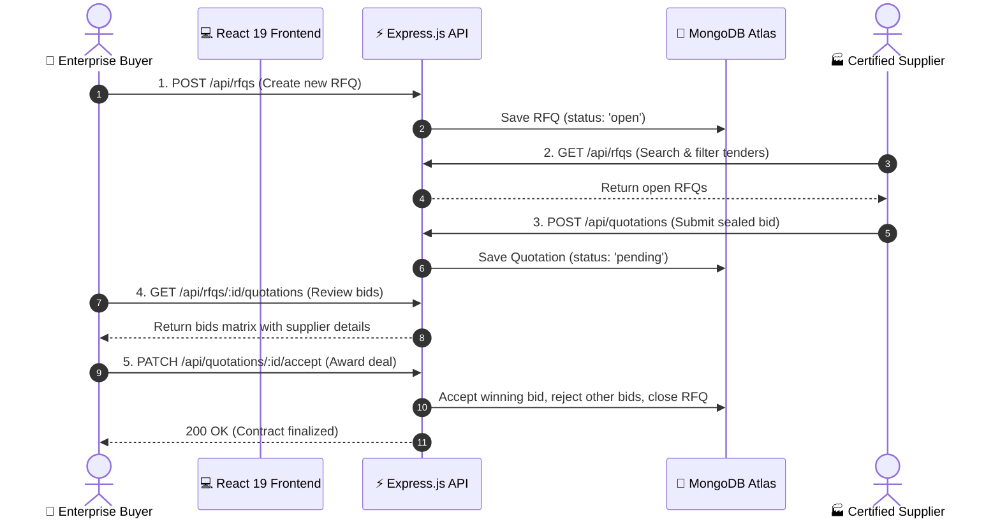

<div align="center">

# 🌐 NexQuote — B2B RFQ Marketplace
### Enterprise Procurement, Sealed Quotations & Global Supply Chain Platform

[](https://github.com/Utkarsh-Tyagi-16/B2B-RFQ-Marketplace)
[](https://github.com/Utkarsh-Tyagi-16/B2B-RFQ-Marketplace)
[](https://nodejs.org/)
[](https://react.dev/)
[](https://www.mongodb.com/atlas)
[](https://render.com)
[](LICENSE)

<p align="center">
  A production-ready, full-stack <strong>Request for Quotation (RFQ)</strong> platform designed to connect enterprise buyers with verified international suppliers through transparent tender broadcasts, sealed bidding, and 1-click contract awards.
</p>

[Quick Start](#-quick-start) • [Features](#-core-features) • [Architecture](#-architecture--workflow) • [API Reference](#-api-endpoints) • [Testing](#-testing)

</div>

---

## ⚡ Demo Accounts

Use these pre-configured roles to explore the platform locally or in production:

| Role | Email | Password | Access & Capabilities |
|---|---|---|---|
| **Enterprise Buyer** | `buyer@enterprise.com` | `Password123!` | Create & edit RFQs, review bids, accept quotes, close tenders |
| **Certified Supplier** | `supplier@globalmfg.com` | `Password123!` | Browse live RFQ radar, submit sealed bids, track quote status |

---

## ✨ Core Features

### 🏢 For Enterprise Buyers
- **RFQ Publishing**: Create comprehensive tenders with product specifications, required quantities, delivery locations, and closing deadlines.
- **Sealed Bid Comparison**: Compare submitted proposals side-by-side with calculated lead times, per-unit pricing, and supplier credentials.
- **1-Click Deal Awarding**: Accept a quotation to instantly award the contract, auto-reject competing bids, and close the RFQ.
- **Tender Management**: Track open, in-review, and closed RFQs in real time.

### 🏭 For Certified Suppliers
- **Live Procurement Radar**: Search and filter active RFQs by keywords and geographic delivery hubs.
- **Sealed Quotation Submission**: Submit private, confidential bids with delivery turnaround estimates and supplier notes.
- **Quotation Ledger**: Track submitted bids with live status indicators (`pending`, `accepted`, `rejected`).
- **Zero-Collusion Environment**: Competitor bids remain completely hidden from other suppliers.

---

## 🔄 Architecture & Workflow



---

## 🛠 Tech Stack

| Layer | Technologies |
|---|---|
| **Frontend** | React 19, Vite 8, React Router v7, Axios, Vanilla CSS3 (Custom Design System) |
| **Backend** | Node.js (v22 LTS), Express.js 4, RESTful Architecture |
| **Database** | MongoDB Atlas, Mongoose 8 (Text & Compound Indexes) |
| **Auth & Security** | JWT (Bearer Tokens), bcryptjs (12 salt rounds), Role-Based Access Control (RBAC) |
| **Testing** | Node.js Native Test Runner (`node:test`, 45 automated unit tests) |
| **Deployment** | Render (Web Service for Backend, Static Site for Frontend) |

---

## 🚀 Quick Start

### Prerequisites
- **Node.js**: `v20.x` or higher (`v22 LTS` recommended)
- **MongoDB**: Local MongoDB or free [MongoDB Atlas](https://www.mongodb.com/cloud/atlas) URI
- **Git**

### 1. Clone Repository
```bash
git clone https://github.com/Utkarsh-Tyagi-16/B2B-RFQ-Marketplace.git
cd B2B-RFQ-Marketplace
```

### 2. Backend Setup
```bash
cd backend
cp .env.example .env    # On Windows: copy .env.example .env
npm install
npm run dev
```
> Configure `.env` with your `MONGODB_URI`, `JWT_SECRET`, and `CLIENT_URL=http://localhost:5173`.  
> Backend runs at: **`http://localhost:5000`** (Health check: `/api/health`)

### 3. Frontend Setup
In a new terminal:
```bash
cd frontend
npm install
npm run dev
```
> Frontend runs at: **`http://localhost:5173`**

---

## 🧪 Testing

The backend includes an automated **45-test unit suite** with zero external testing dependencies using Node's native test runner:

```bash
cd backend
npm test
```

```text
✔ Auth Controller — Unit Tests (7 tests)
✔ RFQ Controller — Unit Tests (12 tests)
✔ Quotation Controller — Unit Tests (8 tests)
✔ Middleware & Model Utilities — Unit Tests (18 tests)

============================================================
TOTAL: 45 passed (0 failed)
============================================================
```

---

## 📡 API Endpoints

### Authentication
| Method | Endpoint | Access | Description |
|---|---|---|---|
| `POST` | `/api/auth/signup` | Public | Register new Buyer or Supplier |
| `POST` | `/api/auth/login` | Public | Authenticate user & issue JWT |
| `GET` | `/api/auth/me` | Protected | Fetch current user session |

### RFQ Procurement
| Method | Endpoint | Access | Description |
|---|---|---|---|
| `POST` | `/api/rfqs` | Buyer Only | Publish a new RFQ |
| `GET` | `/api/rfqs/my` | Buyer Only | List RFQs created by authenticated buyer |
| `GET` | `/api/rfqs` | Supplier Only | Search & filter open marketplace RFQs |
| `GET` | `/api/rfqs/:id` | Authenticated | View RFQ details |
| `PUT` | `/api/rfqs/:id` | Buyer (Owner) | Update an active RFQ |
| `DELETE`| `/api/rfqs/:id` | Buyer (Owner) | Soft-delete / close an RFQ |
| `GET` | `/api/rfqs/:id/quotations` | Buyer (Owner) | Inspect quotations received for an RFQ |

### Quotations
| Method | Endpoint | Access | Description |
|---|---|---|---|
| `POST` | `/api/quotations` | Supplier Only | Submit a sealed quote for an open RFQ |
| `GET` | `/api/quotations/my` | Supplier Only | View supplier's submitted quotation history |
| `PATCH` | `/api/quotations/:id/accept` | Buyer (Owner) | Accept winning quote, reject others, close RFQ |

---

## ☁️ Deployment Reference

- **Backend (Render Web Service)**:
  - Root directory: `backend`
  - Build command: `npm install`
  - Start command: `node server.js`
  - Required Env Vars: `MONGODB_URI`, `JWT_SECRET`, `NODE_ENV=production`, `CLIENT_URL`

- **Frontend (Render Static Site)**:
  - Root directory: `frontend`
  - Build command: `npm run build`
  - Publish directory: `dist`
  - SPA Rewrite Rule: `/*` $\rightarrow$ `/index.html`
  - Env Var: `VITE_API_URL=https://<your-backend>.onrender.com/api`

---

## 🔒 Security Highlights

- **Bcrypt Hashing**: Passwords encrypted with 12 salt rounds before database persistence.
- **Strict RBAC**: Route guards prevent suppliers from altering RFQs and buyers from submitting quotes.
- **Sealed Bids**: Competing supplier quotes are invisible to other suppliers; only the RFQ owner can inspect them.
- **Compound Unique Index**: `{ rfqId: 1, supplierId: 1 }` prevents double-bidding by the same supplier on a single tender.
- **Protected Serializations**: User models strip `passwordHash` automatically on JSON output.

---

## 📄 License

Distributed under the **MIT License**. See [`LICENSE`](LICENSE) for details.

<div align="center">
  <sub>Built by <strong>Utkarsh Tyagi</strong> · Powered by React 19, Express, MongoDB Atlas, and Render</sub>
</div>
